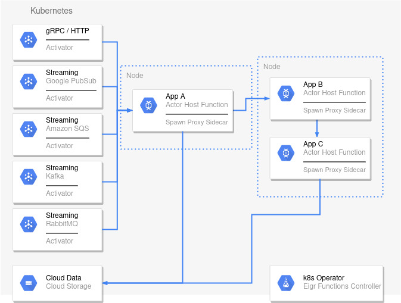
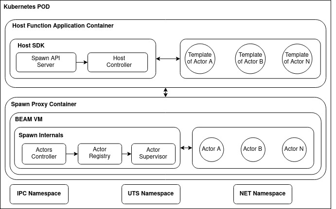

# Spawn

<!-- MDOC !-->

**Actor Mesh Serverless Platform**

   [](https://discord.gg/2PcshvfS93) [](https://discord.gg/2PcshvfS93)

### **[Website](https://eigr.io)** • **[Getting Started](#getting-started)** • **[SDKs](#sdks)** • **[Documentation](https://eigr.io/docs/projects-spawn/spawn-introduction/)** • **[Blog](https://eigr.io/blog/)**

## Overview

**_What is Spawn?_**

There are two ways to answer this question, the short form would be something like:

> "Spawn is an Actor Model framework and Serverless Platform, which does a lot, really lot, of cool stuff that allows you to quickly deliver software oriented to your business domain."

Well since this answer doesn't say much, let's go the long way.

Spawn's main goal is to remove the complexity in developing microservices, providing simple and intuitive APIs, as well as a declarative deployment and configuration model and based on a Serverless architecture and Actor Model.
This leaves the developer to focus on developing the business domain while the platform deals with the complexities and infrastructure needed to support the scalable, resilient, distributed, and event-driven architecture that microservices-driven systems requires.

Spawn is based on the sidecar proxy pattern to provide a polyglot Actor Model framework and platform.
Spawn's technology stack, built on the [BEAM VM](https://www.erlang.org/blog/a-brief-beam-primer/) (Erlang's virtual machine) and [OTP](https://www.erlang.org/doc/design_principles/des_princ.html), provides support for different languages from its native Actor model.

Spawn is made up of the following components:

- A semantic protocol based on Protocol Buffers
- A Sidecar Proxy, written in Elixir, that implements this protocol and persistent storage
  adapters.
- Support libraries in different programming languages.

These are the main concepts:

1. **A Stateful Serverless Platform** running on top of Kubernetes, based on the Sidecar pattern and built on top of the BEAM VM.

2. **Inversion of State**. This means that unlike conventional Serverless architectures where the developer fetches state from persistent storage we on the other hand send the state as the context of the event the function is receiving. Bringing state closer to computing.

3. **Polyglot**. The platform must embrace as many software communities as possible. That's why the polyglot language model is adopted with SDK development for various programming languages.

4. **Less Infrastructure**. This means that our platform will give the developer the tools to focus only on their business without worrying about issues such as:

   - Resource allocation
   - Definition of connections and Pools
   - Service discovery
   - Source/Sink of Events
   - Other infrastructure issues

5. **The basic primitive is the Actor** (from the actors model) and **_not_** the Function (from the traditional serverless architectures).

6. Horizontal scalability with automatic **Activation** and **Deactivation** of Actors on demand.

Watch the video explaining how it works:

[](https://asciinema.org/a/V2zUGsRmOjs0kI7swVTsKg7BQ)

> **_NOTE:_** This video was recorded with an old version of the SDK for Java. That's why errors are seen in Deployment

## What problem Spawn solves

The advancement of Cloud Computing, Edge computing, Containers, Orchestrators, Data-
Oriented Services, and global-scale products aimed at serving audiences in various regions of
our world make the development of software today a task of enormous complexity. It is not
uncommon to see dozens, if not hundreds, of non-functional requirements that must be met
to build a system. All this complexity falls on the developer, who often does not have all the
knowledge or time to create such systems satisfactorily.

When studying this scenario, we realize that many of these current problems belong to the following groups:

- Fast business oriented software delivery.
- State management.
- Scalability.
- Resilience and fault tolerance.
- Distributed and/or regionally distributed computing.
- Integration Services.
- Polyglot services.

The actor model on which Spawn is based can solve almost all the problems on this list, with
Scalability, resilience, fault tolerance, and state management by far the top success stories of
different known actor model implementations. So what we needed to do was add Integration

Services, fast, business-oriented delivery, distributed computing, and polyglot services to the
recipe so we could revolutionize software development as we know it today.

That's precisely what we did with our platform called Eigr Functions Spawn.

Spawn takes care of the entire infrastructure layer by abstracting all the complex issues that
are not part of the business domain it is intended to address.

Particularly domains such as game development, machine learning pipelines, complex event
processing, real-time data ingestion, service integrations, financial or transactional services,
and logistics are some of the domains that can be mastered by the Eigr Functions Spawn
platform.

## Spawn Architecture

Spawn takes the Actor Model's distribution, fault tolerance, and high concurrent capability in
its most famous implementation, the BEAM Erlang VM implementation, and adds to the
flexibility and dynamism that the sidecar pattern offers to build cross-platform and polyglot
microservice-oriented architectures.

To achieve these goals, the Eigr Functions Spawn architecture is composed of the following components:



As seen above, the Eigr Functions Spawn platform architecture is separated into different components, each with its responsibility. We will detail the components below.

- **k8s Operator:** Responsible for interacting with the Kubernetes API and coordinating the deployments of the other components. The user interacts with it using our specific CRDs ([Custom Resource Definitions](https://kubernetes.io/docs/concepts/extend-kubernetes/api-extension/custom-resources/)). We'll talk more about our CRDs later.

- **Cloud Storage:** Despite not being directly part of the platform, it is worth mentioning here that Spawn uses user-defined persistent storage to store the state of its Actors. Different types of persistent storage can be used, such as relational databases such as MySQL, Postgres, among others. In the future, we will support other types of databases, both relational and non-relational.

- **Activators:** Activators are applications responsible for ingesting data from external sources for certain user-defined actors and are configured through their own CRD. They are responsible for listening to a user-configured event and forward this event through a direct invocation to a specific target actor. Different types of Activators exist to consume events from other providers such as Google PubSub, RabbitMQ, Amazon SQS, etc.

- **Actor Host Function:** The container where the user defines his actors and all the business logic of his actors around the state of these actors through a specific SDK for each supported programming language.

- **Spawn Sidecar Proxy:** The centerpiece of the gear is our sidecar proxy; in turn it is responsible for managing the entire lifecycle of user-defined actors through our SDKs and also responsible for managing the state of these actors in persistent storage. The Spawn proxy can also allow the user to develop different integration flows between its actors such as Forwards,
  Effects, Pipes, and in the future, other essential standards such as Saga, Aggregators, Scatter-
  Gather, external invocations, and others.
  Our proxy connects directly and transparently to all cluster members without needing for a single point of failure, i.e., a true mesh network.

As we use Kubernetes to orchestrate our workloads through our Operator each user application will be summarized at the end there is a POD which is the smallest measure of workload present in kubernetes. Below is an image of how the components are grouped inside a POD in Kubernetes:



In turn, each Sidecar container within a POD organizes itself to form an Erlang cluster for each ActorSystem. Different ActorSystems can coexist in the same Kubernetes cluster and these in turn communicate cross ActorSystem using a Nats Broker as a transport mechanism via message passing. In this way we can granulate a large system into smaller parts, forming small Erlang clusters that still manage to maintain the behavior of a larger cluster depending on how the developer organizes its deployable units.

## Features

- [x] Distribution. Automatic and transparent cluster formation via Kubernetes Operator.
  - [x] Erlang Distributed as transport.
    - [x] mTLS Support with Erlang Dist.
    - [x] Automatic renewal of certificates.
  - [x] Cross ActorSystem invocation Nats distribution.
- [x] Configuration management via Kubernetes [CRDs](https://kubernetes.io/docs/tasks/extend-kubernetes/custom-resources/custom-resource-definitions/) and Envinronment Variables.
- [x] Statestores. Adapters for persistent storage using multiple database providers.
  - [x] Sqlite
  - [x] MySql
  - [x] Postgres
  - [x] CockroachDB
  - [x] MSSQL
  - [ ] Native via Mnesia
- [x] Automatic activation and deactivation of Actors.
- [x] Horizontal Scalability
  - [x] automatically controlled by the Operator using Kubernetes HPA based on memory and cpu.
  - [ ] automatically controlled by the Operator via Internal Metrics.
  - [ ] automatically controlled by the Operator via Custom Metrics.
- [x] Workflows
  - [x] Broadcast. Communicates with other actors through pubsub channel semantics.
    - [x] In Memory broadcast. Using [Phoenix.PubSub](https://github.com/phoenixframework/phoenix_pubsub) as transport.
    - [x] Nats broadcast. Using [Nats](https://nats.io/) as transport.
  - [x] External Broadcast. Sends events with pubsub semantics outside the actor system using the same transport types as Broadcast.
  - [x] Forwards. Forwards the input parameter of an action of an actor as input to another action of another actor.
  - [x] Pipes. Forwards the output type of an action of one actor to the input of an action of another actor. Like Unix pipes.
  - [x] Side effects. Sends an effect as a result of your computation for other Actors to handle.
  - [ ] Saga.
- [x] SDKs
  - [x] Elixir. All features implemented.
  - [x] Node/Typescript. All features implemented.
  - [x] Java. Partially implemented.
  - [ ] Python. Under development.
  - [ ] Go. Under development.
  - [ ] Rust. Under development.
  - [ ] .Net/C#. Under development.
- [x] Activators
  - [x] CronJob Scheduler.
  - [x] gRPC/HTTP.
    - [x] Unary. Under development.
    - [ ] Stream In.
    - [ ] Stream Out.
    - [ ] Bid Streamed.
  - [x] RabbitMQ.
  - [ ] Kafka.
  - [ ] Amazon SQS.
  - [ ] Google PubSub.
- [x] Observability
  - [x] OTLP Tracing.
  - [x] Prometheus Metrics.
- [x] Secucrity
  - [x] Database encryption with AES-ACM-V1.
  - [ ] Actor ACL (Access Control List). Under development.
  - [ ] Actor invocation with Authentication/Authorization Basic Auth flow. Under development.
  - [ ] Actor invocation with Authentication/Authorization JWT Auth flow. Under development.

## Install

The recommended way to install Spawn is via our Kubernetes Operator.

### Prerequisites

- Kubernetes Cluster
- Nats broker accessible within the cluster (See the note below).

> **_Important:_** Nats broker is only necessary if you want to use the Activators feature or if you need your actors to communicate between different ActorSystems.

### Instructions

To install you need to download the Operator manifest file. The following command shows how this could be done directly via the command line:

```shell
kubectl create ns eigr-functions && curl -L https://github.com/eigr/spawn/releases/download/{release-version}/manifest.yaml | kubectl apply -f -
```

> **_NOTE:_** You need to inform the desired release version. For example:

```shell
kubectl create ns eigr-functions && curl -L https://github.com/eigr/spawn/releases/download/v1.0.0-rc.17/manifest.yaml | kubectl apply -f -
```

## Getting Started

First we must develop our HostFunction. Look for the documentation for [each SDK](#sdks) to know how to proceed but below are some examples:

- [Using Elixir SDK](./spawn_sdk/spawn_sdk#installation)
- [Using Java SDK](https://github.com/eigr/spawn-springboot-sdk/blob/main/README.md#installation)
- [Using NodeJS SDK](https://github.com/eigr/spawn-node-sdk#installation)

Having our container created and containing our Actor Host Function (following above SDK recommendations), we must deploy
it in a Kubernetes cluster with the Spawn Controller installed (See more about this
process in the section on installation).

In this tutorial we are going to use a MySql database. In this case, in order for Spawn to know how to connect to the database instance, it is first necessary to create a kubernetes secret in same namespace you installed the Spawn Operator with the connection data and other parameters. Example:

```shell
kubectl create secret generic mysql-connection-secret -n eigr-functions \
  --from-literal=database=eigr-functions-db \
  --from-literal=host='mysql' \
  --from-literal=port='3306' \
  --from-literal=username='admin' \
  --from-literal=password='admin' \
  --from-literal=encryptionKey=$(openssl rand -base64 32)
```

Sapwn securely encrypts the Actors' State, so the **_encryptionKey_** item must be informed and must be a key of reasonable size and complexity to ensure the security of your data.

> **_NOTE:_** To learn more about Statestores settings, see the [statestore section](#statestores).

If you are going to use the Activators resource in your project or if you want your Actors to be able to communicate between different ActorSystems then you will need to create a secret with the connection information with the Nats server. See an example of how to do this below:

> **_NOTICE:_** It is not within the scope of this tutorial to install Nats but a simple way to do it in kubernetes is in to run these commands: **helm repo add nats https://nats-io.github.io/k8s/helm/charts/ && helm install spawn-nats nats/nats**.

Now create the config file with the Nats credentials:

```
kubectl -n default create secret generic nats-invocation-conn-secret \
  --from-literal=url="nats://spawn-nats:4222" \
  --from-literal=authEnabled="false" \
  --from-literal=tlsEnabled="false" \
  --from-literal=username="" \
  --from-literal=password=""
```

Now in a directory of your choice, create a file called **_system.yaml_** with the following content:

```yaml
---
apiVersion: spawn-eigr.io/v1
kind: ActorSystem
metadata:
  name: spawn-system # Mandatory. Name of the ActorSystem
  namespace: default # Optional. Default namespace is "default"
spec:
  # This externalInvocation section is necessary only if Nats broker is used in your project.
  externalInvocation:
    enabled: "true"
    externalConnectorRef: nats-invocation-conn-secret
  statestore:
    type: MySql # Valid are [MySql, Postgres, Sqlite, MSSQL, CockroachDB]
    credentialsSecretRef: mysql-connection-secret # The secret containing connection params created in the previous step.
    pool: # Optional
      size: "10"
```

This file will be responsible for creating a system of actors in the cluster.

Now create a new file called **_host.yaml_** with the following content:

```yaml
---
apiVersion: spawn-eigr.io/v1
kind: ActorHost
metadata:
  name: spawn-springboot-example # Mandatory. Name of the Node containing Actor Host Functions
  namespace: default # Optional. Default namespace is "default"
  annotations:
    # Mandatory. Name of the ActorSystem declared in ActorSystem CRD
    spawn-eigr.io/actor-system: spawn-system
spec:
  host:
    image: eigr/spawn-springboot-examples:latest # Mandatory
    ports:
      - name: "http"
        containerPort: 8091
```

This file will be responsible for deploying your host function and actors in the cluster.
But if you are using the SDK for Elixir then your Yaml should look like this:

```yaml
---
apiVersion: spawn-eigr.io/v1
kind: ActorHost
metadata:
  name: spawn-dice-game
  namespace: default
  annotations:
    spawn-eigr.io/actor-system: game-system
spec:
  host:
    embedded: true # This indicates that it is a native BEAM application and therefore does not need a sidecar proxy attached.
    image: eigr/dice-game-example:1.0.0-rc.17
    ports:
      - name: "http"
        containerPort: 8800
```

Now that the files have been defined, we can apply them to the cluster:

```shell
kubectl apply -f system.yaml
kubectl apply -f host.yaml
```

After that, just check your actors with:

```shell
kubectl get actorhosts
```

### Examples

You can find some examples of using Spawn in the links below:

- **Hatch**: https://github.com/zblanco/hatch
- **Elixir Dice Game. Spawn with Phoenix app**: https://github.com/eigr-labs/spawn_game_example.git
- **Distributed Image Processing**: https://github.com/eigr-labs/spawn-distributed-image-processing
- **Federated Data Example**: https://github.com/eigr-labs/spawn-federated-data-example
- **Fleet**: https://github.com/sleipnir/fleet-spawn-example
- **Spawn Polyglot Example**: https://github.com/sleipnir/spawn-polyglot-ping-pong

### Talks

You can see some talks on Youtube about Eigr Community or Spawn in the links below:

- **Marcel Lanz on Code Beam Europe 2022**: https://youtu.be/jgR7Oc_GXAg
- **Adriano Santos on Code Beam BR 2022**: Link not yet released by the event organizers

## SDKs

Another important part of Spawn is the SDKs implemented in different languages that aim to
abstract all the protocol specifics and expose an easy and intuitive API to developers.

| SDK                                                                   | Language |
| --------------------------------------------------------------------- | -------- |
| [C# SDK](https://github.com/eigr-labs/spawn-dotnet-sdk)               | C#       |
| [Elixir](https://github.com/eigr/spawn/tree/main/spawn_sdk/spawn_sdk) | Elixir   |
| [Go SDK](https://github.com/eigr/spawn-go-sdk)                        | Go       |
| [Spring Boot SDK](https://github.com/eigr/spawn-springboot-sdk)       | Java     |
| [NodeJS/Typescript SDK](https://github.com/eigr/spawn-node-sdk)       | Node     |
| [Python SDK](https://github.com/eigr-labs/spawn-python-sdk)           | Python   |
| [Rust SDK](https://github.com/eigr-labs/spawn-rust-sdk)               | Rust     |

### Custom Resources

Spawn defines some custom Resources for the user to interact with the API for deploying Spawn artifacts in Kubernetes. We'll talk more about these CRDs in the Getting Started section but for now we'll list each of these resources below for a general understanding of the concepts:

- **ActorSystem CRD:** The user must define the ActorSystem CRD before it attempts to
  deploy any other Spawn features. In it, the user defines some general parameters for the
  functioning of the actor cluster and the parameters of the persistent storage connection for a
  given system. Multiple ActorSystems can be defined but remember that they must be
  referenced equally in the Actor Host Functions. Examples of this CRD can be found in the
  [examples/k8s folder](examples/k8s/simple/system.yaml).

- **ActorHost CRD:** A ActorHost is a cluster member application. An ActorHost, by
  definition, is a Kubernetes Deployment and will contain two containers, one containing the
  Actor Host Function user application and another container for the Spawn proxy, which is
  responsible for connecting to the proxies cluster via Distributed Erlang and also for providing
  all the necessary abstractions for the functioning of the system such as state management,
  activation, and passivation of actors, among other infrastructure tasks. Examples of this CRD
  can be found in the [examples/k8s folder](examples/k8s/simple/host.yaml).

- **Activator CRD:** Activator CRD defines any means of inputting supported events such as
  queues, topics, HTTP, or grpc endpoints and maps these events to the appropriate actor to
  handle them. Examples of this CRD can be found in the [examples/k8s
  folder](examples/k8s/activators).

## Statestores

Statestores are the interface between the downstream storage/database system and the actor.
They are configured by the user via environment variables or by the ActorSystem CRD (see [Custom Resources section](#custom-resources)) and their sensitive data is [stored in kubernetes secrets](#getting-started).

Below is a list of common global settings for all Statestores. For more details check the [documentation](docs/statestore.md) for each supported Statestore.

| Environment Variable        | CRD Attribute                        | Secret Property | Default Env Value | Default CRD Value | Mandatory | Possible Values                         |
| --------------------------- | ------------------------------------ | --------------- | ----------------- | ----------------- | --------- | --------------------------------------- |
|                             | spec.statestore.credentialsSecretRef |                 |                   |                   | Yes       |
| PROXY_DATABASE_TYPE         | spec.statestore.type                 |                 |                   |                   | Yes       | see [documentation](docs/statestore.md) |
| PROXY_DATABASE_NAME         |                                      | database        | eigr-functions-db | eigr-functions-db |           |
| PROXY_DATABASE_USERNAME     |                                      | username        | admin             | admin             |           |
| PROXY_DATABASE_SECRET       |                                      | password        | admin             | admin             |           |
| PROXY_DATABASE_HOST         |                                      | host            | localhost         | localhost         |           |
| PROXY_DATABASE_PORT         |                                      | port            | adapter specific  | adapter specific  |           | see [documentation](docs/statestore.md) |
| SPAWN_STATESTORE_KEY        |                                      | encryptionKey   |                   |                   | Yes       | openssl rand -base64 32                 |
| PROXY_DATABASE_POOL_SIZE    | spec.statestore.pool.size            |                 | 60                | 60                |           |
| PROXY_DATABASE_QUEUE_TARGET | spec.statestore.pool.queue           |                 | 10000             | 10000             |           |
| PROXY_DATABASE_SSL          | spec.statestore.ssl                  |                 | false             | false             |           |
| PROXY_DATABASE_SSL_VERIFY   | spec.statestore.ssl_verify           |                 | false             | false             |           |

> **_NOTE:_** When running on top of Kubernetes you only need to set the CRD attributes of ActorSystem and Kubernetes secrets. The Operator will set the values of the environment variables according to the settings of these two mentioned places.

## Local Development

> **_NOTE:_** All scripts will use a MySQL DB with a database called eigr-functions-db by default. Make sure you have a working instance on your localhost or you will have to change make tasks or run commands manually during testing.

Tests:

```shell
make test
```

Run:

```shell
make build run-proxy-local
```

For more information on how to collaborate or even to get to know the project structure better, go to our [contributor guide](CONTRIBUTING.md)

## Main Concepts

The sections below will discuss the main concepts that guided our architectural choices.

### The Protocol

Spawn is based on [Protocol Buffers](https://developers.google.com/protocol-buffers) and a
super simple [HTTP stack](https://github.com/eigr/spawn/blob/main/docs/protocol.md)
to allow a heterogeneous layer of communication between different services which can, in
turn, be implemented in any language that supports the gRPC protocol.

The Spawn protocol itself is described [here](https://github.com/eigr/spawn/blob/main/priv/protos/eigr/functions/protocol/actors/protocol.proto).

### The Actor Model

According to [Wikipedia](https://en.wikipedia.org/wiki/Wikip%C3%A9dia:P%C3%A1gina_principal) Actor Model is:

"A mathematical model of concurrent computation that treats actor as the universal primitive of concurrent computation. In response to a message it receives, an actor can: [make local decisions, create more actors, send more messages, and determine how to respond to the next message received](https://www.youtube.com/watch?v=7erJ1DV_Tlo&t=22s). Actors may modify their own private state, but can only affect each other indirectly through messaging (removing the need for lock-based synchronization).

The actor model originated in [1973](https://www.ijcai.org/Proceedings/73/Papers/027B.pdf). It has been used both as a framework for a theoretical understanding of computation and as the theoretical basis for several practical implementations of concurrent systems."

The Actor Model was proposed by Carl Hewitt, Peter Bishop, and Richard Steiger and is
inspired by several characteristics of the physical world.

Although it emerged in the 70s of the last century, only in the previous two decades of our
century has this model gained strength in the software engineering communities due to the
massive amount of existing data and the performance and distribution requirements of the
most current applications.

For more information about the Actor Model, see the following links:

https://en.wikipedia.org/wiki/Actor_model

https://codesync.global/media/almost-actors-comparing-pony-language-to-beam-languages-erlang-elixir/

https://www.infoworld.com/article/2077999/understanding-actor-concurrency--part-1--actors-in-erlang.html

https://doc.akka.io/docs/akka/current/general/actors.html

### The Sidecar Pattern

The sidecar pattern is a pattern for implementing Service Meshs and Microservices
architectures where an external software is placed close to the real service to provide non-
functional characteristics such as interfacing with the underlying network, routing, and data
transformation between other orthogonal requirements to the business.

The sidecar allows components to access services from any location or programming language.
The sidecar can also be a translator for cross-language dependency management as a
communication proxy mechanism. This benefits distributed applications with complex
integration requirements and applications that rely on external business integrations.

For more information about the Sidecar Pattern, see the following links:

https://www.techtarget.com/searchapparchitecture/tip/The-role-of-sidecars-in-microservices-architecture

https://docs.microsoft.com/en-us/azure/architecture/patterns/sidecar

https://www.youtube.com/watch?v=j7JKkbAiWuI

https://medium.com/nerd-for-tech/microservice-design-pattern-sidecar-sidekick-pattern-dbcea9bed783

### Nats

We use [Nats](https://nats.io/) for communication between different systems like Activators or cross ActorSystems. According to the project page "NATS is a simple, secure and performant communications system for digital systems, services and devices. NATS is part of the Cloud Native Computing Foundation (CNCF). NATS has over 40 client language implementations, and its server can run on-premise, in the cloud, at the edge, and even on a Raspberry Pi. NATS can secure and simplify design and operation of modern distributed systems."

Nats' ability to natively implement different topologies, as well as its minimalism, its cloud-native nature, and its capabilities to run on more constrained devices is what made us use Nats over other solutions. Nats allows Spawn to be able to provide strong isolation from an ActorSystem without limiting the user, allowing the user to still be able to communicate securely between different ActorSystems. Nats also facilitates the implementation of our triggers, called Activators, allowing those even without being part of an Erlang cluster to be able to invoke any actors.
