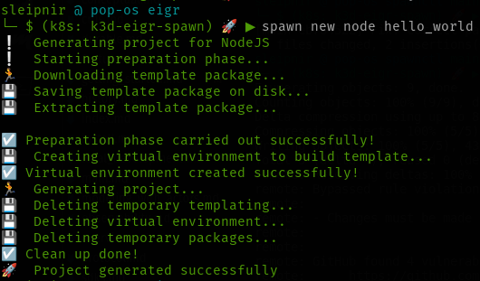
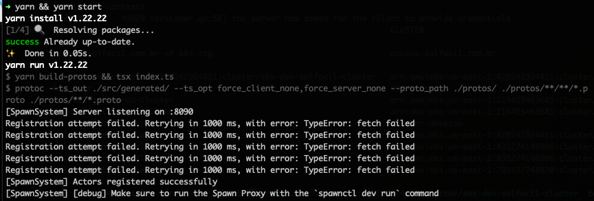
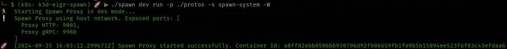

# Getting Started

To begin, you'll need to develop your HostFunction application. Refer to the documentation for each [SDK](sdks.md) to learn how to proceed with your preferred programming language.

- [Using Elixir SDK](./spawn_sdk/spawn_sdk#installation)
- [Using Java SDK](https://github.com/eigr/spawn-java-std-sdk#getting-started)
- [Using NodeJS SDK](https://github.com/eigr/spawn-node-sdk#installation)
- [Using Python SDK](https://github.com/eigr/spawn-python-sdk#getting-started)

Alternatively, you can quickly scaffold a Spawn application [using the CLI](install.md).

For example, to create a NodeJS application template, run the following command:

```shell
spawn new node hello_world
```

This will generate output similar to the following:



Next, navigate to your newly created application's directory, install dependencies, and start the application:

```shell
cd hello_world; yarn && yarn start
```

The output should look something like this:



Spawn uses a lightweight proxy that handles the underlying implementation of services and provides infrastructure for your application. To fully test your services, you'll need to run this proxy in your development environment.

Run the following command to start the proxy:

```shell
spawn dev run -p ./protos -s spawn-system -W
```



Once the proxy is up and running, you can invoke your application's actors. In this NodeJS example, Spawn uses gRPC-HTTP transcoding to convert HTTP requests into actor invocations. You can call your actor by sending an HTTP request like this:

```shell
curl -vvv -H 'Accept: application/json' http://localhost:9980/v1/hello_world?message=World
```

> **_NOTE:_** Ensure you're sending requests to the gRPC port displayed in the console when the proxy is running. The proxy transparently handles the conversion between HTTP and actor invocations. For more details on how the transcoding engine works, refer to each SDK's documentation.

You can also check out the following gif for another example:


Once you have done the initial setup you can start developing your actors in several available languages. See below how easy it is to do this:

<table class="styled-table">
  <thead>
    <tr>
      <th>Language</th>
      <th>Example</th>
    </tr>
  </thead>
  <tbody>
<tr>
  <td>Typescript</td>
  <td>
  <details open>
    <summary>Show Code</summary>

```js
import spawn, { ActorContext, Value } from '@eigr/spawn-sdk'
  import { UserState, ChangeUserNamePayload, ChangeUserNameStatus } from 'src/protos/examples/user_example'

  const system = spawn.createSystem('SpawnSystemName')

  const actor = system.buildActor({
    name: 'joe',
    stateType: UserState, // or 'json' if you don't want to use protobufs
    stateful: true,
  })

  const setNameHandler = async (context: ActorContext<UserState>, payload: ChangeUserNamePayload) => {
    return Value.of<UserState, ChangeUserNameResponse>()
      .state({ name: payload.newName })
      .response(ChangeUserNameResponse, { status: ChangeUserNameStatus.OK })
  }

  actor.addAction({ name: 'setName', payloadType: ChangeUserNamePayload }, setNameHandler)
```
  </details>
  </td>
</tr>
    <tr>
      <td>Elixir</td>
      <td>
      <details>
        <summary>Show Code</summary>

```elixir
defmodule SpawnSdkExample.Actors.MyActor do
  use SpawnSdk.Actor,
    name: "joe",
    kind: :named,
    stateful: true, 
    state_type: Io.Eigr.Spawn.Example.MyState, # or :json if you don't care about protobuf types
  
  require Logger
  
  alias Io.Eigr.Spawn.Example.{MyState, MyBusinessMessage}

  action "Sum", fn %Context{state: state} = ctx, %MyBusinessMessage{value: value} = data ->
    Logger.info("Received Request: #{inspect(data)}. Context: #{inspect(ctx)}")
    new_value = if is_nil(state), do: value, else: (state.value || 0) + value

    Value.of(%MyBusinessMessage{value: new_value}, %MyState{value: new_value})
  end
end
```
  </details>
  </td>
</tr>
<tr>
  <td>Java</td>
  <td>
  <details>
    <summary>Show Code</summary>

```java
package io.eigr.spawn.java.demo;

import io.eigr.spawn.api.actors.ActorContext;
import io.eigr.spawn.api.actors.StatefulActor;
import io.eigr.spawn.api.actors.Value;
import io.eigr.spawn.api.actors.behaviors.ActorBehavior;
import io.eigr.spawn.api.actors.behaviors.BehaviorCtx;
import io.eigr.spawn.api.actors.behaviors.NamedActorBehavior;
import io.eigr.spawn.api.actors.ActionBindings;
import domain.Reply;
import domain.Request;
import domain.State;

import static io.eigr.spawn.api.actors.behaviors.ActorBehavior.*;

public final class JoeActor implements StatefulActor<State> {

    @Override
    public ActorBehavior configure(BehaviorCtx context) {
        return new NamedActorBehavior(
                name("JoeActor"),
                channel("test.channel"),
                action("SetLanguage", ActionBindings.of(Request.class, this::setLanguage))
        );
    }

    private Value setLanguage(ActorContext<State> context, Request msg) {
        if (context.getState().isPresent()) {
            //Do something with previous state
        }

        return Value.at()
                .response(Reply.newBuilder()
                        .setResponse(String.format("Hi %s. Hello From Java", msg.getLanguage()))
                        .build())
                .state(updateState(msg.getLanguage()))
                .reply();
    }

    private State updateState(String language) {
        return State.newBuilder()
                .addLanguages(language)
                .build();
    }
}
```
  </details>
  </td>
</tr>
<tr>
  <td>Python</td>
  <td>
  <details>
    <summary>Show Code</summary>

```python
from domain.domain_pb2 import JoeState, Request
from spawn.eigr.functions.actors.api.actor import Actor
from spawn.eigr.functions.actors.api.settings import ActorSettings
from spawn.eigr.functions.actors.api.context import Context
from spawn.eigr.functions.actors.api.value import Value

actor = Actor(settings=ActorSettings(
    name="joe", stateful=True, channel="test"))


@actor.action("setLanguage")
def set_language(request: Request, ctx: Context) -> Value:
    new_state = None

    if not ctx.state:
        new_state = JoeState()
        new_state.languages.append("python")
    else:
        new_state = ctx.state

    return Value().state(new_state).noreply()
```
  </details>
  </td>
</tr>
<tr>
  <td>Rust</td>
  <td>
  <details>
    <summary>Show Code</summary>

```rust
use spawn_examples::domain::domain::{Reply, Request, State};
use spawn_rs::{value::Value, Context, Message};

use log::info;

pub fn set_language(msg: Message, ctx: Context) -> Value {
    info!("Actor msg: {:?}", msg);
    return match msg.body::<Request>() {
        Ok(request) => {
            let lang = request.language;
            info!("Setlanguage To: {:?}", lang);
            let mut reply = Reply::default();
            reply.response = lang;

            match &ctx.state::<State>() {
                Some(state) => Value::new()
                    .state::<State>(&state.as_ref().unwrap(), "domain.State".to_string())
                    .response(&reply, "domain.Reply".to_string())
                    .to_owned(),
                _ => Value::new()
                    .state::<State>(&State::default(), "domain.State".to_string())
                    .response(&reply, "domain.Reply".to_string())
                    .to_owned(),
            }
        }
        Err(_e) => Value::new()
            .state::<State>(&State::default(), "domain.State".to_string())
            .to_owned(),
    };
}
```
  </details>
  </td>
</tr>
</tbody></table>

### Deploy

Once your container is built and contains the Actor Host Function (following the SDK recommendations above), it's time to deploy it to a Kubernetes cluster with the Spawn Operator installed. [See the installation section for more details on this process.](install.md)

In this tutorial, we will use a MariaDB database. To allow Spawn to connect to your database instance, you'll first need to create a Kubernetes secret in the same namespace where you installed the Spawn Operator. This secret will store the connection details and other required parameters. Here's an example:

```shell
kubectl create secret generic mariadb-connection-secret -n eigr-functions \
  --from-literal=database=eigr-functions-db \
  --from-literal=host='mariadb' \
  --from-literal=port='3306' \
  --from-literal=username='admin' \
  --from-literal=password='admin' \
  --from-literal=encryptionKey=$(openssl rand -base64 32)
```

Spawn securely encrypts the Actor's state, so the **_encryptionKey_** must be provided. Ensure the key is of sufficient length and complexity to protect your data.

> **_NOTE:_** For more information on Statestore settings, see the [statestore section](statestores.md).

If your project uses the Activators or Projection feature or if you need your Actors to communicate between different ActorSystems, you'll also need to create a secret with connection details for the Nats server. Here's how:

> **_NOTICE:_** This tutorial does not cover installing Nats, but you can install it in Kubernetes with these commands: **helm repo add nats https://nats-io.github.io/k8s/helm/charts/ && helm install spawn-nats nats/nats**.

Now, create a configuration file with Nats credentials:

```
kubectl -n default create secret generic nats-invocation-conn-secret \
  --from-literal=url="nats://spawn-nats:4222" \
  --from-literal=authEnabled="false" \
  --from-literal=tlsEnabled="false" \
  --from-literal=username="" \
  --from-literal=password=""
```
Next, in your preferred directory, create a file called **_system.yaml_** with the following content:

```yaml
---
apiVersion: spawn-eigr.io/v1
kind: ActorSystem
metadata:
  name: spawn-system # 1. Required. Name of the ActorSystem
  namespace: default # 2. Optional. Default namespace is "default"
spec:
  # This externalInvocation section is required only if using the Nats broker in your project.
  externalInvocation:
    enabled: "true"
    externalConnectorRef: nats-invocation-conn-secret # 3. Nats broker credentials
  statestore:
    type: MariaDB # 4. Set database provider. Valid options: [MariaDB, Postgres, Native]
    credentialsSecretRef: mariadb-connection-secret # 5. Secret with database connection details created earlier
    pool: # Optional
      size: "10"
```

This file defines your ActorSystem within the Kubernetes cluster.

Now, create another file called **_host.yaml_** with the following content:

```yaml
---
apiVersion: spawn-eigr.io/v1
kind: ActorHost
metadata:
  name: spawn-springboot-example # 1. Required: Name of the node hosting Actor Functions
  namespace: default # 2. Optional: Default namespace is "default"
  annotations:
    # 3. Required: ActorSystem name as declared in ActorSystem CRD
    spawn-eigr.io/actor-system: spawn-system
spec:
  host:
    image: eigr/spawn-springboot-examples:latest # 4. Required: Container image
    ports:
      - name: "http"
        containerPort: 8091
```

This file handles the deployment of your host function and actors.

If you’re using the Elixir SDK, your YAML file should look like this:

```yaml
---
apiVersion: spawn-eigr.io/v1
kind: ActorHost
metadata:
  name: spawn-dice-game
  namespace: default
  annotations:
    spawn-eigr.io/actor-system: game-system
spec:
  host:
    embedded: true # Indicates a native BEAM application, so no sidecar proxy is needed
    image: eigr/dice-game-example:1.4.3
    ports:
      - name: "http"
        containerPort: 8800
```

Once the files are defined, apply them to the cluster with the following commands:

```shell
kubectl apply -f system.yaml
kubectl apply -f host.yaml
```

Finally, check your deployed actors with:

```shell
kubectl get actorhosts
```

### Examples

Here are some project examples using Spawn:

- **Hatch**: https://github.com/zblanco/hatch
- **Elixir Dice Game. (Spawn with Phoenix app)**: https://github.com/eigr-labs/spawn_game_example.git
- **Distributed Image Processing**: https://github.com/eigr-labs/spawn-distributed-image-processing
- **Federated Data Example**: https://github.com/eigr-labs/spawn-federated-data-example
- **Fleet**: https://github.com/sleipnir/fleet-spawn-example
- **Postal Code Search**: https://github.com/h3nrique/postalcode-spawn-demo
- **Spawn Polyglot Example**: https://github.com/sleipnir/spawn-polyglot-ping-pong

In the next section, you'll find links to each supported SDK.

> **_NOTICE:_** Not all examples may be up to date with the latest versions of Spawn and its SDKs.

[Next: SDKs](sdks.md)

[Previous: Install](install.md)
