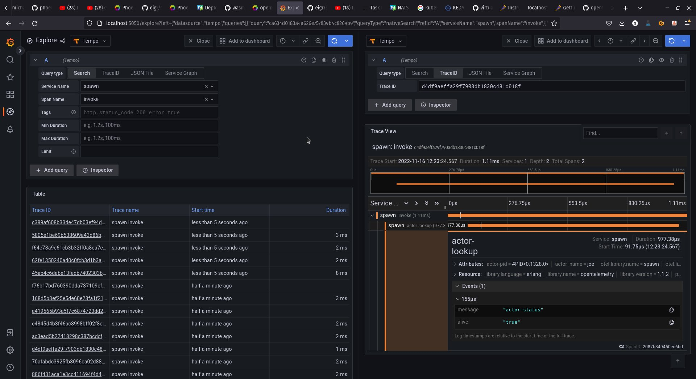
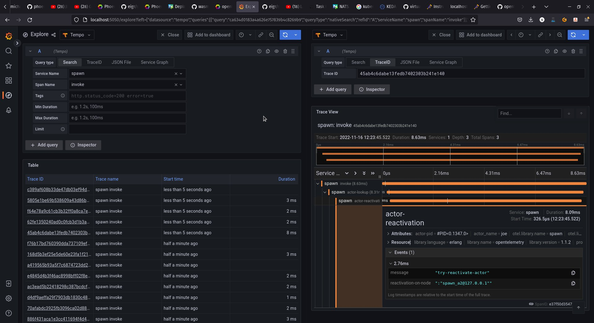

# Observability

Spawn exports metrics in Prometheus format and also pushes traces in OTLP format. See below how invocation traces can be viewed using a tool that works with this format, such as Grafana Tempo.

[Next: Local Development](local_development.md)

[Previous: Activators](activators.md)